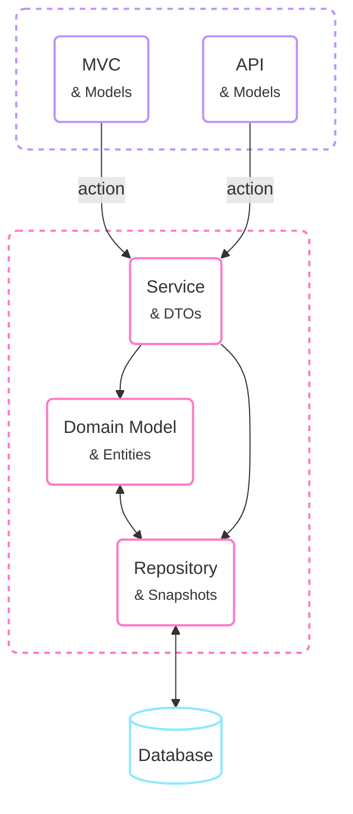
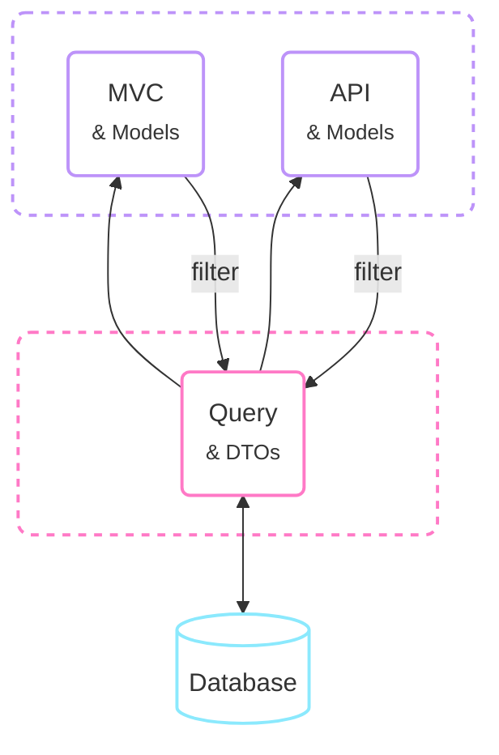
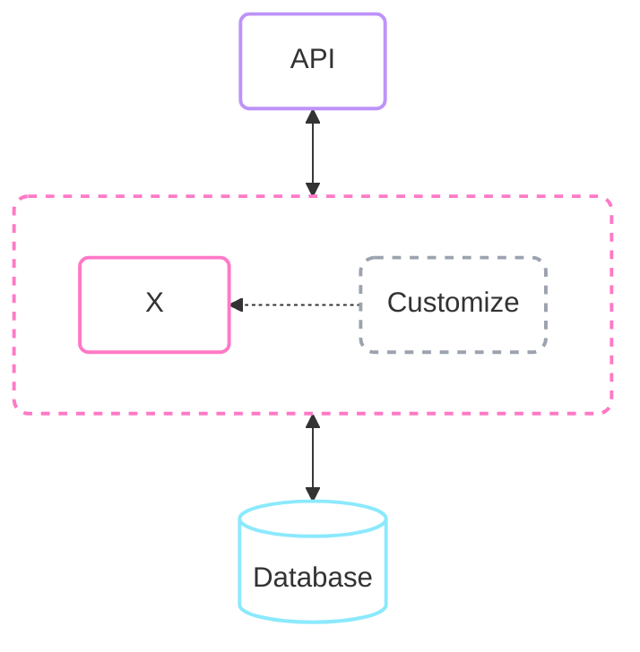

# Strapi introduction

Content Management System

A Headless CMS

---
hideInToc: true
---

# Agenda

<div class="pb-24 flex items-center h-full">
<div class="w-64 flex-auto">

<Toc minDepth="1" maxDepth="1" />

</div>

<div class="w-64 flex-auto flex flex-col items-center text-center">

**Slides**


https://oidatiftla.github.io/strapi-presentation/

</div>
</div>

---
hideInToc: true
---

# Before We Start

<div class="pb-24 flex flex-col justify-center h-full gap-8">

<v-click>

> You've probably already solved this.

</v-click>

<v-click>

> Forget CMS, forget Strapi — think about the CRUD layer you've rewritten a dozen times.

</v-click>

<v-click>

> CMS — I thought: website content. Then discovered **headless**: just **API** with **schema builder**

</v-click>

<v-click>

> Is a Database a CMS?

</v-click>

</div>

---

# The Problem

<div class="pb-24 flex items-center h-full">
<div class="flex-auto">

An internal tool: managing **materials of projects**

Built with **.NET Framework + EF6** using Domain-Driven Design

<br>

<v-click>

> "Someone asked me to add a single new field..."

</v-click>

</div>
<div class="flex-auto">

<v-click>


</v-click>

</div>
</div>

---
hideInToc: true
---
<!-- layout: two-cols -->

## DDD – A Quick Overview

<!--
<div class="pb-24 flex items-center h-full">
<div>

<v-click>

**Aggregates**

- **Aggregates** cluster entities/value objects behind a single consistency boundary

</v-click>
<v-click>

**IDs**

- Only the **Aggregate root** has a public ID
- External refs use the root ID — never a child
- Access children via the root: `cart.Items[x]`

</v-click>
<v-click>

**Example**

- `ShoppingCart` owns its `Items`
- `Item` has no ID outside the cart

</v-click>

</div>
</div>

::right::
-->

<div class="flex gap-4 text-xs items-center h-full">
<v-click>
<div class="w-30 flex-auto"><!-- remove when two columns layout used --></div>
<div class="text-gray-400 font-bold tracking-widest text-[11px] select-none" style="writing-mode:vertical-rl;transform:rotate(180deg)">Write</div>
<div class="w-60 flex-auto">



<div class="text-[10px] mt-1" style="color:#bd93f9">— User Interface</div>
<div class="text-[10px] mt-1" style="color:#ff79c6">— DDD Boundary</div>
</div>
</v-click>
<div class="w-30 flex-auto"><!-- remove when two columns layout used --></div>
<v-click>
<div class="w-px bg-gray-600 self-stretch mx-1"></div>
<div class="w-30 flex-auto"><!-- remove when two columns layout used --></div>
<div class="w-64 flex-auto">



</div>
<div class="text-gray-400 font-bold tracking-widest text-[11px] select-none" style="writing-mode:vertical-rl">Read</div>
</v-click>
<div class="w-30 flex-auto"><!-- remove when two columns layout used --></div>
</div>

---
hideInToc: true
---

## Adding One Field ...

<div class="pb-4 flex items-center h-full">
<div>

<v-clicks>

- `[1]` Adjust database schema **&** Write DB migration script **&** Update ORM model
- `[2]` Update Snapshot <span class="text-gray-500">& ORM model mapping</span>
- `[3]` Update Domain Model <span class="text-gray-500">& Snapshot mapping</span>
- `[4]` Update Query DTO **&** Query
- `[5]` Update MVC Model **&** Translation <span class="text-gray-500">& Query DTO mapping</span>
- `[6]` Update Controller validation (MVC)
- `[7]` Update Razor View
- `[8]` Update API Model **&** Swagger example data <span class="text-gray-500">& Query DTO mapping</span>
- `[9]` Update API Controller validation, filter, sort
- `[10]` Update Vue API service **&** Vue store
- `[11]` Update Vue component View

</v-clicks>

<br>

<v-clicks>

> Simple fields take hours — it felt **unproductive**. Most of the work was just creating the same field everywhere and mapping it.

</v-clicks>

</div>
</div>

---

# What I Was Looking For

<div class="flex gap-4 items-center h-full">
<div class="w-64 flex-auto">

<v-clicks>

- **Self-hosted**
- **Open source**
- **Single schema definition** — no duplication across layers
- **Auto-generated DB** — and migrations
- **Auto-generated REST API** — with configurable permissions
- **Authentication** — SSO / LDAP / Active Directory
- **Authorization** — SSO / LDAP / Active Directory
- **Audit logging** — track changes
- **Extensible** — non-negotiable

</v-clicks>

<br>

<v-click>

> Keeps simple things simple — but allows custom logic where necessary.

</v-click>

<br>
<br>

</div>
<v-click>
<div class="w-6"></div>
<div class="w-16 flex-auto">



<br>

<div class="text-[10px] mt-1" style="color:#bd93f9">— User Interface</div>
<div class="text-[10px] mt-1" style="color:#ff79c6">— System to-be-defined</div>
</div>
</v-click>
</div>

---

# Strapi

<div class="flex items-center h-full">
<div>

- **Self-hosted**&nbsp;&nbsp;&nbsp;<span class="text-green-500 font-bold">✔</span>
- **Open source**&nbsp;&nbsp;&nbsp;<span class="text-green-500 font-bold">✔</span>&nbsp;&nbsp;&nbsp;MIT
- **Single schema definition**&nbsp;&nbsp;&nbsp;<span class="text-green-500 font-bold">✔</span>&nbsp;&nbsp;&nbsp;Admin UI
- **Auto-generated DB**&nbsp;&nbsp;&nbsp;<span class="text-green-500 font-bold">✔</span>&nbsp;&nbsp;&nbsp;SQLite, PostgreSQL, MySQL
- **Auto-generated REST API**&nbsp;&nbsp;&nbsp;<span class="text-green-500 font-bold">✔</span>&nbsp;&nbsp;&nbsp;+ GraphQL
- **Authentication**&nbsp;&nbsp;&nbsp;<span class="text-yellow-500 font-bold">partially</span>&nbsp;&nbsp;&nbsp;(SSO only for non admin users — or <span class="underline">paid version</span>)
- **Authorization**&nbsp;&nbsp;&nbsp;<span class="text-red-500 font-bold">x</span>&nbsp;&nbsp;&nbsp;(not via SSO; permissions: entity-wide, not field-based — customize or <span class="underline">paid version</span>)
- **Audit logging**&nbsp;&nbsp;&nbsp;<span class="text-red-500 font-bold">x</span>&nbsp;&nbsp;&nbsp;(not out of the box, but hooks allow easy interception — or <span class="underline">paid version</span>)
- **Extensible**&nbsp;&nbsp;&nbsp;<span class="text-green-500 font-bold">✔</span>&nbsp;&nbsp;&nbsp;controllers, services, policies, middleware when needed

<br>

<v-click>

> Honest note: Node.js was not my preferred backend.

</v-click>

<br>
<br>

</div>
</div>

---
title: Demo
---

# Demo (NPM)

<div class="pb-24 flex items-center h-full">
<div class="flex-auto">

```bash
npx create-strapi-app@latest

npm run develop
```

<br>

Local admin panel: `http://localhost:1337/admin`

</div>
</div>

---
hideInToc: true
---

# Demo (PNPM)

<div class="pb-24 flex items-center h-full">
<div class="flex-auto">

```bash
pnpx create-strapi-app@latest

pnpm run develop
```

<br>

Local admin panel: `http://localhost:1337/admin`

<br>

GitHub Issue: [Strapi fails on first run with pnpm on macOS (better-sqlite3 bindings missing)](https://github.com/strapi/strapi/issues/25226)

```json
{
  // ...
  "pnpm": {
    "onlyBuiltDependencies": ["better-sqlite3"]
  }
}
```

</div>
</div>

---
layout: image-right
image: /strapi-admin-panel.png
hideInToc: true
---

## Admin Panel

<div class="pb-24 flex items-center h-full">
<div class="flex-auto">

- Model your data:
  - **Collection types** — e.g. articles, users
  - **Single types** — e.g. homepage content
  - **Components** — reusable field groups

- Localizable content

- Generates code in the background — you can always **copy & paste** things later

</div>
</div>

---
layout: two-cols
hideInToc: true
---

## Field Types

<div class="pb-24 flex items-center h-full">
<div class="flex-auto">

- Simple fields (text, number, boolean, date)
- JSON
- Markdown / Blocks
- Media
- Relations
- Components
- Dynamic zones (multiple components)

</div>
</div>

::right::

<div class="h-95% w-full">
  
</div>

---
hideInToc: true
---

### Text Field - advanced options


---
hideInToc: true
---

### Relation Field


---
title: REST API & GraphQL
---

# REST API

<div class="flex gap-4 items-center h-full">
<div class="flex-auto">

Auto-generated when you save a content type.

<br>

````md magic-move
```bash
# REST
GET  http://localhost:1337/api/articles
POST http://localhost:1337/api/articles
```

```bash {4-5}
# REST
GET  http://localhost:1337/api/articles
POST http://localhost:1337/api/articles
# filter: $eq, $between, $contains, $startsWith, $or, $and, $not, ...
GET  http://localhost:1337/api/articles?filters[price][$lt]=100
```

```bash {6-7}
# REST
GET  http://localhost:1337/api/articles
POST http://localhost:1337/api/articles
# filter: $eq, $between, $contains, $startsWith, $or, $and, $not, ...
GET  http://localhost:1337/api/articles?filters[price][$lt]=100
# sort: asc, desc
GET  http://localhost:1337/api/articles?sort[0]=description&sort[1]=name:desc
```

```bash {8-12}
# REST
GET  http://localhost:1337/api/articles
POST http://localhost:1337/api/articles
# filter: $eq, $between, $contains, $startsWith, $or, $and, $not, ...
GET  http://localhost:1337/api/articles?filters[price][$lt]=100
# sort: asc, desc
GET  http://localhost:1337/api/articles?sort[0]=description&sort[1]=name:desc
# populate
GET  http://localhost:1337/api/articles?fields[0]=name&fields[1]=description
GET  http://localhost:1337/api/articles?populate=*
GET  http://localhost:1337/api/articles?populate[headerImage][fields][0]=name&populate[headerImage][fields][1]=url
GET  http://localhost:1337/api/articles?populate[categories][sort][0]=name:asc&populate[categories][filters][name][$eq]=Cars
```

```bash {13-15}
# REST
GET  http://localhost:1337/api/articles
POST http://localhost:1337/api/articles
# filter: $eq, $between, $contains, $startsWith, $or, $and, $not, ...
GET  http://localhost:1337/api/articles?filters[price][$lt]=100
# sort: asc, desc
GET  http://localhost:1337/api/articles?sort[0]=description&sort[1]=name:desc
# populate
GET  http://localhost:1337/api/articles?fields[0]=name&fields[1]=description
GET  http://localhost:1337/api/articles?populate=*
GET  http://localhost:1337/api/articles?populate[headerImage][fields][0]=name&populate[headerImage][fields][1]=url
GET  http://localhost:1337/api/articles?populate[categories][sort][0]=name:asc&populate[categories][filters][name][$eq]=Cars
# pagination: by page or offset
GET  http://localhost:1337/api/articles?pagination[page]=1&pagination[pageSize]=10
GET  http://localhost:1337/api/articles?pagination[start]=0&pagination[limit]=10
```
````

<br>

> No need to write controller code or register routes. Everything is generated by default.

<br>

<v-click>

`qs`: A querystring parser and serializer with nesting support: https://github.com/ljharb/qs

</v-click>

</div>

<v-after>
<div class="pb-24 flex-auto font-sm">

```js
const query = qs.stringify({
  filters: {
    $and: [
      {
        $or: [
          {
            date: {
              $eq: '2020-01-01',
            },
          },
          {
            date: {
              $eq: '2020-01-02',
            },
          },
        ],
      },
      {
        author: {
          name: {
            $eq: 'Kai doe',
          },
        },
      },
    ],
  },
}, { encodeValuesOnly: true, /* prettify URL */ });
```

</div>
</v-after>
</div>

---
layout: image-right
image: /strapi-graphql.png
hideInToc: true
---

# GraphQL

<div class="pb-24 flex items-center h-full">
<div>

```bash
npm install @strapi/plugin-graphql
```

<br>

Playground at: http://localhost:1337/graphql

</div>
</div>

---
title: Extensibility
---

# Extensibility through plugins and **custom code**

<div class="pb-24 flex items-center h-full">
<div class="flex-auto">

When the defaults are not enough, everything is overridable:

<br>

- <Link to="extend-controller">Controller</Link>
- <Link to="extend-service">Service</Link>
- <Link to="extend-router">Router</Link>
- <Link to="extend-policy">Middleware</Link>
- <Link to="extend-hooks">Document Service</Link>
- <Link to="extend-hooks">Query Engine</Link>

<br>

> The generated code is the floor — you can always go deeper.

</div>
</div>

---

# What's Missing?

*(in the Open Source edition)*

<div class="pb-24 flex items-center h-full">
<div class="flex-auto">

- Field-based permissions <span class="text-gray-500">— OSS only on entity level</span>

- SSO for the admin panel users <span class="text-gray-500">— OSS only end-users</span>

- Multiple roles per end-user <span class="text-gray-500">— only admin panel users allow multiple roles</span>

- Provider sync <span class="text-gray-500">— can't map OpenID Connect claims to user properties automatically</span>

<br>

</div>
</div>

---
layout: end
hideInToc: true
---

# Thank you for your attention

<br>

> Strapi is not a universal solution — it's just the one that solved my pain.

---
hideInToc: true
---

# Appendix – REST API Queries

Using `qs` to build query strings in the frontend: https://github.com/ljharb/qs

```js {monaco-run} { height: '310px', lineNumbers: true }
import qs from 'qs';

console.log(qs.stringify({
  foo: {
    bar: 'baz',
  },
}, { encode: false }));
```

---
hideInToc: true
---

## Appendix – Filters – Simple

```js {monaco-run} { height: '360px', lineNumbers: true }
import qs from 'qs';

console.log('/api/restaurants?' + qs.stringify({
  filters: {
    username: {
      $eq: 'John',
    },
  },
}, { encode: false }));
```

---
hideInToc: true
---

## Appendix – Filters – And, Or

```js {monaco-run} { height: '360px', lineNumbers: true }
import qs from 'qs';

console.log('/api/restaurants?' + qs.stringify({
  filters: {
    $or: [
      { date: { $eq: '2020-01-01' } },
      { date: { $eq: '2020-01-02' } },
    ],
    author: { name: { $eq: 'Kai doe' } },
  },
}, { encode: false }));
```

---
hideInToc: true
---

## Appendix – Filters – Deep

```js {monaco-run} { height: '360px', lineNumbers: true }
import qs from 'qs';

console.log('/api/restaurants?' + qs.stringify({
  filters: {
    chef: {
      restaurants: {
        stars: {
          $eq: 5,
        },
      },
    },
  },
}, { encode: false }));
```

---
hideInToc: true
---

## Appendix – Select – Simple

```js {monaco-run} { height: '360px', lineNumbers: true }
import qs from 'qs';

console.log('/api/articles?' + qs.stringify({
  fields: ['name', 'description'],
}, { encode: false }));
```

---
hideInToc: true
---

## Appendix – Populate – Simple

```js {monaco-run} { height: '360px', lineNumbers: true }
import qs from 'qs';

console.log('/api/articles?' + qs.stringify({
  populate: [ 'headerImage', 'author' ],
}, { encode: false }));
```

---
hideInToc: true
---

## Appendix – Populate – All

```js {monaco-run} { height: '360px', lineNumbers: true }
import qs from 'qs';

console.log('/api/articles?' + qs.stringify({
  populate: '*',
}, { encode: false }));
```

---
hideInToc: true
---

## Appendix – Populate & Select

```js {monaco-run} { height: '360px', lineNumbers: true }
import qs from 'qs';

console.log('/api/articles?' + qs.stringify({
  fields: ['title', 'slug'],
  populate: {
    headerImage: {
      fields: ['name', 'url'],
    },
  },
}, { encode: false }));
```

---
hideInToc: true
---

## Appendix – Populate & Filter & Sort

```js {monaco-run} { height: '360px', lineNumbers: true }
import qs from 'qs';

console.log('/api/articles?' + qs.stringify({
  populate: {
    categories: {
      sort: ['name:asc'],
      filters: {
        name: {
          $eq: 'Cars',
        },
      },
    },
  },
}, { encode: false }));
```

---
hideInToc: true
---

## Appendix – Locale

```js {monaco-run} { height: '360px', lineNumbers: true }
import qs from 'qs';

console.log('/api/articles?' + qs.stringify({
  locale: 'fr',
}, { encode: false }));
```

---
hideInToc: true
---

## Appendix – Architecture


---
routeAlias: extend-controller
hideInToc: true
---

## Appendix – Controller

`src/api/article/controllers/article.ts`

````md magic-move {lines: true}
```ts {*|7}
/**
 *  article controller
 */

import { factories } from '@strapi/strapi';

export default factories.createCoreController('api::article.article');
```

<!-- https://docs.strapi.io/cms/backend-customization/controllers -->

```ts {7-16}
/**
 *  article controller
 */

import { factories } from '@strapi/strapi';

export default factories.createCoreController('api::article.article', ({ strapi }) => ({
  // Method 1: Creating an entirely custom action
  async exampleAction(ctx) {
    try {
      ctx.body = 'ok';
    } catch (err) {
      ctx.body = err;
    }
  },
}));
```

```ts {7-21}
/**
 *  article controller
 */

import { factories } from '@strapi/strapi';

export default factories.createCoreController('api::article.article', ({ strapi }) => ({
  // Method 2: Wrapping a core action (leaves core logic in place)
  async find(ctx) {
    // some custom logic here
    ctx.query = { ...ctx.query, local: 'en' }

    // Calling the default core action
    const { data, meta } = await super.find(ctx);

    // some more custom logic
    meta.date = Date.now()

    return { data, meta };
  },
}));
```

```ts {7-24}
/**
 *  article controller
 */

import { factories } from '@strapi/strapi';

export default factories.createCoreController('api::article.article', ({ strapi }) => ({
  // Method 3: Replacing a core action with proper sanitization
  async find(ctx) {
    // validateQuery (optional)
    // to throw an error on query params that are invalid or the user does not have access to
    await this.validateQuery(ctx);

    // sanitizeQuery to remove any query params that are invalid or the user does not have access to
    // It is strongly recommended to use sanitizeQuery even if validateQuery is used
    const sanitizedQueryParams = await this.sanitizeQuery(ctx);
    const { results, pagination } = await strapi.service('api::restaurant.restaurant').find(sanitizedQueryParams);

    // sanitizeOutput to ensure the user does not receive any data they do not have access to
    const sanitizedResults = await this.sanitizeOutput(results, ctx);

    return this.transformResponse(sanitizedResults, { pagination });
  },
}));
```
````

---
hideInToc: true
---

## Appendix – Sanitization when utilizing controller factories

| Function Name    | Parameters                 | Description                                                                          |
| ---------------- | -------------------------- | ------------------------------------------------------------------------------------ |
| `sanitizeQuery`  | `ctx`                      | Sanitizes the request query                                                          |
| `sanitizeOutput` | `entity`/`entities`, `ctx` | Sanitizes the output data where entity/entities should be an object or array of data |
| `sanitizeInput`  | `data`, `ctx`              | Sanitizes the input data                                                             |
| `validateQuery`  | `ctx`                      | Validates the request query (throws an error on invalid params)                      |
| `validateInput`  | `data`, `ctx`              | (EXPERIMENTAL) Validates the input data (throws an error on invalid data)            |

<!-- https://docs.strapi.io/cms/backend-customization/controllers#sanitization-when-utilizing-controller-factories -->

---
routeAlias: extend-service
hideInToc: true
---

## Appendix – Service

`src/api/article/services/article.ts`

````md magic-move {lines: true}
```ts {*|7}
/**
 * article service.
 */

import { factories } from '@strapi/strapi';

export default factories.createCoreService('api::article.article');
```

<!-- https://docs.strapi.io/cms/backend-customization/services -->

```ts {7-18}
/**
 * article service.
 */

import { factories } from '@strapi/strapi';

export default factories.createCoreService('api::article.article', ({ strapi }) => ({
  // Method 1: Creating an entirely custom service
  async exampleService(...args) {
    let response = { okay: true }

    if (response.okay === false) {
      return { response, error: true }
    }

    return response
  },
}));
```

```ts {7-20}
/**
 * article service.
 */

import { factories } from '@strapi/strapi';

export default factories.createCoreService('api::article.article', ({ strapi }) => ({
  // Method 2: Wrapping a core service (leaves core logic in place)
  async find(...args) {
    // Calling the default core controller
    const { results, pagination } = await super.find(...args);

    // some custom logic
    results.forEach(result => {
      result.counter = 1;
    });

    return { results, pagination };
  },
}));
```

```ts {7-12}
/**
 * article service.
 */

import { factories } from '@strapi/strapi';

export default factories.createCoreService('api::article.article', ({ strapi }) => ({
  // Method 3: Replacing a core service
  async findOne(documentId, params = {}) {
     return strapi.documents('api::restaurant.restaurant').findOne(documentId, this.getFetchParams(params));
  },
}));
```
````

---
routeAlias: extend-router
hideInToc: true
---

## Appendix – Router

`src/api/article/routes/article.ts`

````md magic-move {lines: true}
```ts {*|7}
/**
 * article router.
 */

import { factories } from '@strapi/strapi';

export default factories.createCoreRouter('api::article.article');
```

<!-- https://docs.strapi.io/cms/backend-customization/routes -->

```ts {7-16}
/**
 * article router.
 */

import { factories } from '@strapi/strapi';

export default factories.createCoreRouter('api::article.article', {
  only: ['find'],
  config: {
    find: {
      auth: false,
      policies: [],
      middlewares: [],
    },
  },
});
```

```ts {7-24}
/**
 * article router.
 */

import { factories } from '@strapi/strapi';

export default factories.createCoreRouter('api::article.article', {
  config: {
    find: {
      policies: [
        // point to a registered policy
        'policy-name',

        // point to a registered policy with some custom configuration
        { name: 'policy-name', config: {} },

        // pass a policy implementation directly
        (policyContext, config, { strapi }) => {
          return true;
        },
      ],
    },
  },
});
```

```ts {7-24}
/**
 * article router.
 */

import { factories } from '@strapi/strapi';

export default factories.createCoreRouter('api::article.article', {
  config: {
    find: {
      middlewares: [
        // point to a registered middleware
        'middleware-name',

        // point to a registered middleware with some custom configuration
        { name: 'middleware-name', config: {} },

        // pass a middleware implementation directly
        (ctx, next) => {
          return next();
        },
      ],
    },
  },
});
```
````

---
routeAlias: extend-policy
hideInToc: true
---

## Appendix – Policy

`src/policies/is-authenticated.ts` or `src/api/[api-name]/policies/my-policy.ts`

<!-- https://docs.strapi.io/cms/backend-customization/policies -->

````md magic-move {lines: true}
```ts
export default (policyContext, config, { strapi }) => {
  if (policyContext.state.user) {
    // if a session is open
    // go to next policy or reach the controller's action
    return true;
  }

  // if you return nothing, Strapi considers you didn't want to block the request and will let it pass
  return false;
};
```

```ts
export default (policyContext, config, { strapi }) => {
  if (policyContext.state.user.role.code === config.role) {
    // if user's role is the same as the one described in configuration
    // go to next policy or reach the controller's action
    return true;
  }

  // if you return nothing, Strapi considers you didn't want to block the request and will let it pass
  return false;
};
```
````

---
routeAlias: extend-hooks
hideInToc: true
---

## Appendix – Lifecycle Hooks on Models

`src/index.ts`

````md magic-move {lines: true}
```ts
import type { Core } from '@strapi/strapi';

export default {
  bootstrap({ strapi }: { strapi: Core.Strapi }) {
  },
};
```

```ts {5-19}
import type { Core } from '@strapi/strapi';

export default {
  bootstrap({ strapi }: { strapi: Core.Strapi }) {
    strapi.db.lifecycles.subscribe({
      async beforeCreate(event) {},
      async beforeCreateMany(event) {},

      async beforeUpdate(event) {},
      async beforeUpdateMany(event) {},

      async beforeDelete(event) {},
      async beforeDeleteMany(event) {},

      async beforeCount(event) {},

      async beforeFindOne(event) {},
      async beforeFindMany(event) {},
    });
  },
};
```

```ts {5-19}
import type { Core } from '@strapi/strapi';

export default {
  bootstrap({ strapi }: { strapi: Core.Strapi }) {
    strapi.db.lifecycles.subscribe({
      async afterCreate(event) {},
      async afterCreateMany(event) {},

      async afterUpdate(event) {},
      async afterUpdateMany(event) {},

      async afterDelete(event) {},
      async afterDeleteMany(event) {},

      async afterCount(event) {},

      async afterFindOne(event) {},
      async afterFindMany(event) {},
    });
  },
};
```

```ts {5-17}
import type { Core } from '@strapi/strapi';

export default {
  bootstrap({ strapi }: { strapi: Core.Strapi }) {
    strapi.db.lifecycles.subscribe({
      // {
      //   action: 'afterCreate',
      //   model: { uid: 'api::article.article', ... },
      //   params: { data: { some_relation: [...], someProperty: 'Lorem Ipsum', ... }, ... },
      //   result: { id: 17, documentId: 'f13aeb6ba90fc0b93a110849', someProperty: 'Lorem Ipsum', ... },
      //   ...
      // }
      async afterCreate(event) {
        const { model, params, result } = event;
        // your work here
      },
    });
  },
};
```
````

---
hideInToc: true
zoom: 0.9
---

## Appendix – Schema

`src/api/article/content-types/article/schema.json`

````md magic-move {lines: true}
```json
{
  "kind": "collectionType",
  "collectionName": "articles",
  "info": {
    "singularName": "article",
    "pluralName": "articles",
    "displayName": "Article",
    "description": "Create your blog content"
  },
  "options": {
    "draftAndPublish": true
  },
  "pluginOptions": {},
  "attributes": {
    "title": {
      "type": "string"
    },
    "description": {
      "type": "text",
      "maxLength": 80
    },
    "slug": {
      "type": "uid",
      "targetField": "title"
    },
    "cover": {
      "type": "media",
      "multiple": false,
      "required": false,
      "allowedTypes": ["images", "files", "videos"]
    },
    "author": {
      "type": "relation",
      "relation": "manyToOne",
      "target": "api::author.author",
      "inversedBy": "articles"
    },
    "category": {
      "type": "relation",
      "relation": "manyToOne",
      "target": "api::category.category",
      "inversedBy": "articles"
    },
    "blocks": {
      "type": "dynamiczone",
      "components": ["shared.media", "shared.quote", "shared.rich-text", "shared.slider"]
    }
  }
}
```
````
